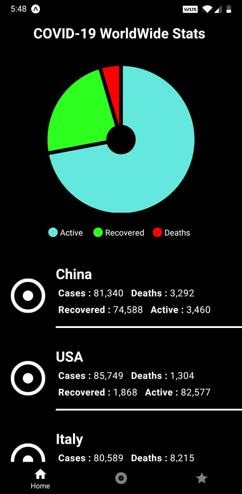
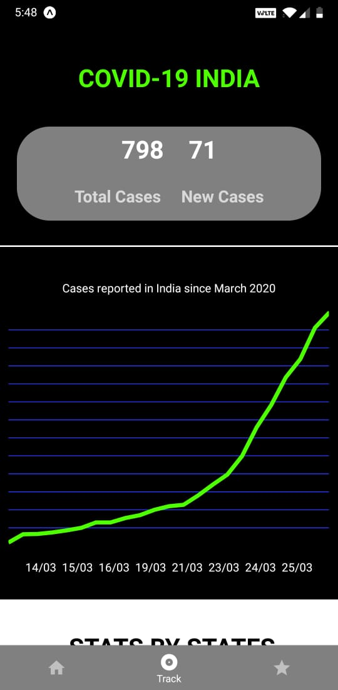
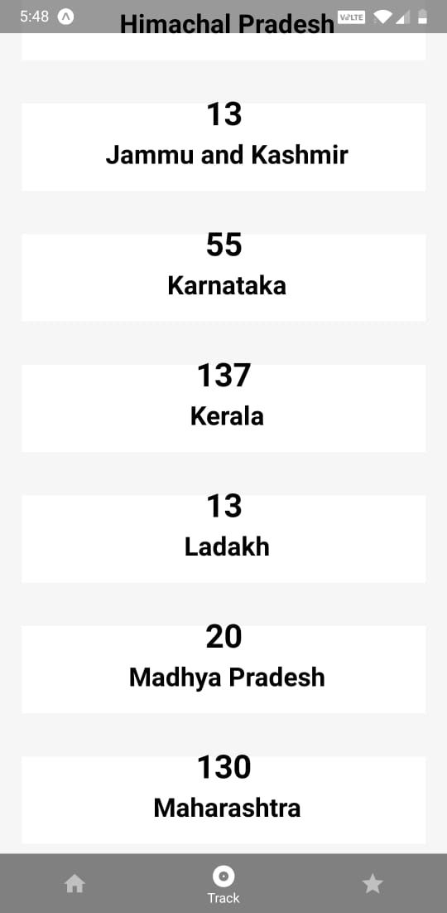

<p align="center">
  <a href="https://github.com/AnupNair08/Covid-19-Tracker/">
    
  </a>

  <h3 align="center">Covid-19 Tracker</h3>

  <p align="center">
    A simple application to track and display Covid-19 cases
    <br />
    ·
    <a href="https://github.com/AnupNair08/Covid-19-Tracker/issues">Report Bug</a>
    ·
    <a href="https://github.com/AnupNair08/Covid-19-Tracker/issues">Request Feature</a>
  </p>
</p>
<hr>

This is a hybrid app built for a real-time COVID-19 Tracking. It shows details of cases from around the world with a focused tracker for India.
State wise statistics fetched by (COVID-19) tracker that uses sparklines in Google Sheets to visualize the spread of the coronavirus outbreak across different states of India over time.

## Features

- Worldwide statistics of Covid-19 cases.
- Country-specific list of cases.
- State wise stats for India.
- Graphical data interpretation.

## Tools

1. React Native
2. Expo
3. Turtle

## To build the application

```
Clone the repo
Run npm i
Run expo start

Install Expo application on your mobile to tunnel the built application for testing.
```

## Screenshots :

</img>        </img>           </img>

<hr>
#### Note:
The application was built for learning purposes and some of the APIs might be down. Future improvements to be worked upon. :)
